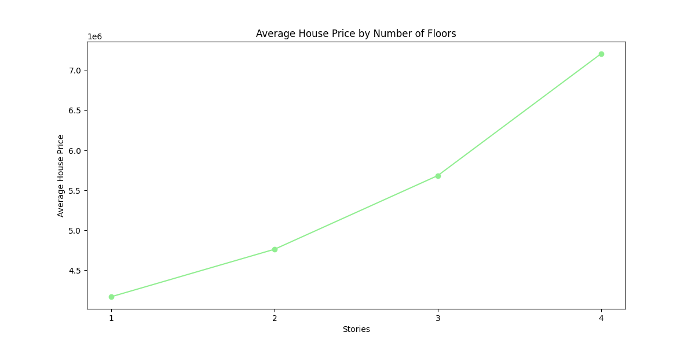

# House Prices Prediction 

## Introduction
House Price Prediction is a crucial part of understanding and managing the real estate market. This project aims to analyze and predict house prices based on factors such as area, number of bedrooms, and other characteristics of the house.

Understanding the value of these factors not only helps buyers and sellers make smarter decisions but also helps investors identify potential investment opportunities and minimize risks.

The project uses data from Kaggle[[1]](https://www.kaggle.com/datasets/harishkumardatalab/housing-price-prediction/data) and applies data analysis methods as well as machine learning models to analyze and predict house prices. The analysis results will provide insights into the factors affecting house prices and help stakeholders make more accurate decisions in choosing to buy a house.

## Summary of analysis results
### 1. Average House Price by Equipment status: 
As you can see the chart shows that:
- **Furnished houses** have the highest average price.
- **Unfurnished houses** have a lower average price.
- **Semi-furnished houses** have the lowest average price.

### 2. Average House Price by Equipment status: 

As you can see, the prices of houses located in priority areas are higher than the prices of houses that are not located in priority areas, however, choosing to buy a house that is not located in priority areas is also not a bad choice if you do not have enough financial resources.

### 3. Average House Price by Equipment status

Houses with more floors clearly have higher prices. This could be due to various factors such as higher construction costs.

**Advice for customers**:
- If you do not have sufficient finances, choosing a single-story house is a reasonable option for you.
- If you need more space, multi-story houses will meet this need, but you need to prepare for higher costs.
- Besides the number of floors, you should also consider other factors such as location, availability of full amenities, and the condition of the interior to make a suitable house purchase decision.

## Files

- `LICENSE`: The file contains information about the document's license.
- `README.md`: Manual file, providing an overview of the document and how to use it.
- `requirements.txt`: The file contains a list of libraries required to run the notebook.
- `notebook.ipynb`: This jupyter Notebook file containing source code, data analysis.
- `Housing.csv`[[1]](https://www.kaggle.com/datasets/harishkumardatalab/housing-price-prediction/data): The database contains information about homes, including factors such as price, square footage, number of bedrooms, number of bathrooms, and many other characteristics.

## References

- [[1]](https://www.kaggle.com/datasets/harishkumardatalab/housing-price-prediction/data): Comprehensive Dataset for Price Forecasting with 13 key Features.

## LICENSE

- This data can be used publicly (CC0 (No Copyright)).
- You can see more details in here [here](https://creativecommons.org/publicdomain/zero/1.0/)

## Thanks

Thanks to Kaggle for providing the data to make this project possible. Thanks for reviewing and reading our project!
